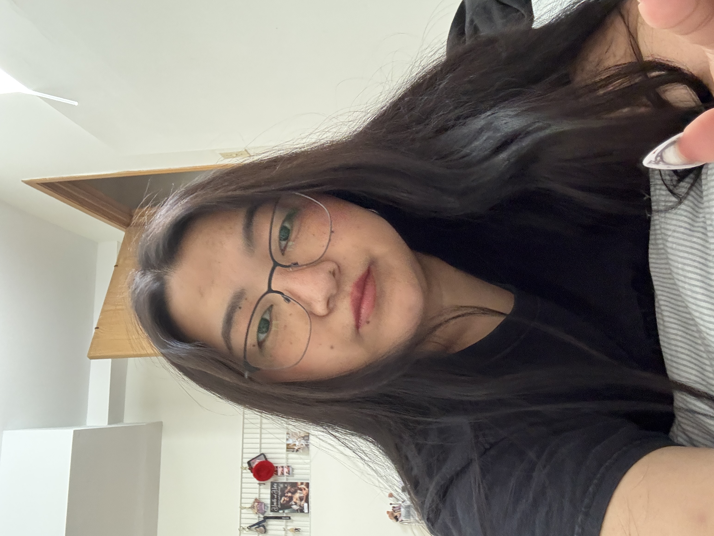

::: {.landing-wrapper}
::: {.landing-card}

::: {.landing-header}
# Choki Lhamo {.landing-name}
MBA Portfolio · University Canada West 
:::

::: {.landing-avatar-wrap}
{.landing-avatar}
:::

::: {.landing-intro}
MBA candidate focusing on digital transformation, marketing, and operations. Passionate about turning complex problems into clear, people-friendly solutions.
:::

::: {.landing-links}
[Home](index.qmd){.landing-pill}
[Resume](resume.qmd){.landing-pill}
[Projects](projects.qmd){.landing-pill}
[Skills](skills.qmd){.landing-pill}
[Contact](contact.qmd){.landing-pill}
:::

:::
:::

## Welcome

Hi! My name is Choki Lhamo and I am a MBA candidate in University Canada West with an international exposure in the fields of education, media, and community relations. My stay and job in Bhutan, Thailand, and Canada have gifted me a global perspective on leadership, collaboration, and problem-solving. The different cultures I interacted with in my academic and professional life have developed my flexibility, communication, and organization skills which in turn made me able to perform well in multi-cultural and interdisciplinary settings.

I plan to use the knowledge and skills gained from my MBA studies to become an expert in strategic and analytical thinking so that I could better see how data-driven insights and inclusive management practices can together enhance operational efficiency. Besides, I would like to focus on the avenues through which innovation and ethical leadership can create sustainable values for both organizations and their communities.

I want to put my learning process into practice to create fair systems that equips people, unite them in a better way, and eventually lead to an impact that is both social and organizational but is also meaningful.

This website is my MBA portfolio where I share my projects, assignments, skills, and academic progress.

## What I’m Working Toward

- **Strategic thinker:** Using data and frameworks (like value chains, VSMs, and HR analytics) to support better decisions.  
- **Digital problem-solver:** Curious about automation, AI, and tools that remove friction from everyday work.  
- **Inclusive collaborator:** I care about fair systems, diverse teams, and respectful workplaces.

---

## Explore My Portfolio

Ready to take a closer look? Start here:

- [View my Resume](resume.qmd) – Education, experience, and core strengths  
- [Explore Projects](projects.qmd) – Selected MBA case studies and assignments  
- [Skills & Tools](skills.qmd) – Business, analytical, and digital capabilities  
- [Contact Me](contact.qmd) – Let’s connect about roles or collaborations
